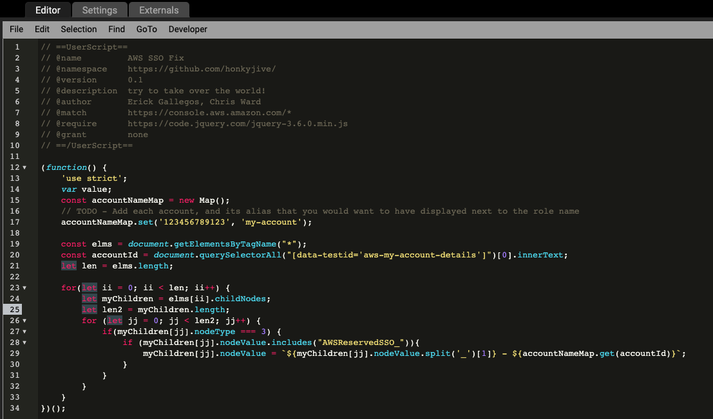

# aws-sso-role-header-fix

## Instructions

1. Download a user script plugin for your browser. I recommend tampermonkey and enable it.

- [Chrome](https://www.tampermonkey.net/?ext=dhdg&browser=chrome)
- [Edge](https://www.tampermonkey.net/?ext=dhdg&browser=edge)
- [Safari](https://www.tampermonkey.net/?ext=dhdg&browser=safari)
- [Firefox](https://www.tampermonkey.net/?ext=dhdg&browser=firefox)
- [Opera](https://www.tampermonkey.net/?ext=dhdg&browser=opera)
- [Dolphin Browser](https://www.tampermonkey.net/?ext=dhdg&browser=dolphin)
- [UC Browser](https://www.tampermonkey.net/?ext=dhdg&browser=ucweb)

2. In the tampermonkey plugin menu select `Create a New Script`

3. Paste in the `aws-fix-role.js` script

4. Update `line 17` with your first account ID and alias, then add any additional accounts as needed.

5. Save the code `ctrl + s`

And you are done.

## Key points and good to knows

This script will not execute if the site doesn't start with `https://console.aws.amazon.com`

I've disabled updates because tampermonkey can be dangerous with autoupdates on.
